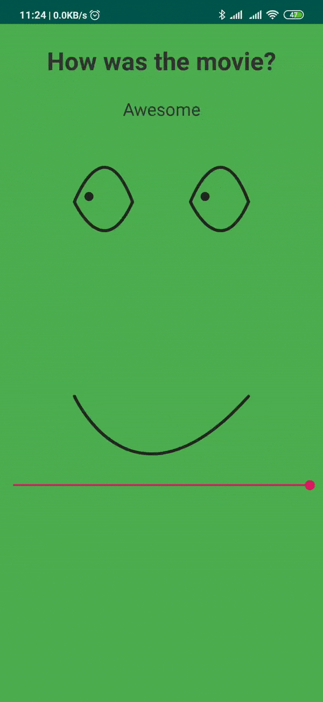

# HappyView
HappyView is a simple custom Ui to showcase the rating

[](https://jitpack.io/#godwinjk/HappyView)




## How to use

Add the code in xml
```
 <com.godwin.happyratingview.HappyView
        android:id="@+id/happyView"
        android:layout_width="match_parent"
        android:layout_height="200dp"
        android:layout_marginStart="20dp"
        android:layout_marginTop="20dp"
        android:layout_marginEnd="20dp"
        app:eyeColor="@color/darkGray2"
        app:irisColor="@color/darkGray2"
        app:layout_constraintEnd_toEndOf="parent"
        app:layout_constraintStart_toStartOf="parent"
        app:layout_constraintTop_toBottomOf="@+id/tvAns"
        app:max="100"
        app:pathColor="@color/darkGray2"
        app:progress="100" />
```

### NOTE: Project not completed
